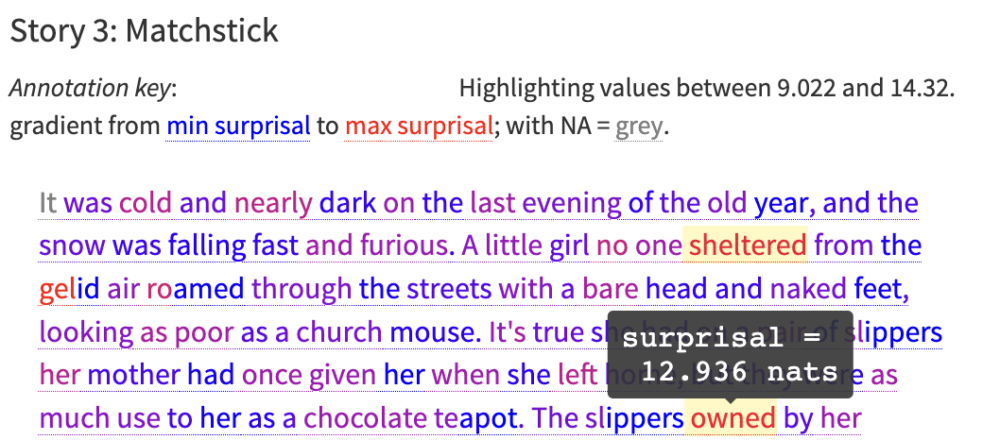

This repository contains code to accompany the article:

**The Plausibility of Sampling as an Algorithmic Theory of Sentence Processing**. Jacob Louis Hoover, Morgan Sonderegger, Steven T. Piantadosi, Timothy J. O'Donnell. Forthcoming in _Open Mind_ (2023). 

- Preprint: [osf.io/qjnpv](https://doi.org/10.31234/osf.io/qjnpv)

- See here for [Surprisal Explorer](https://jahoo.shinyapps.io/surprisal_explorer/) --- interactive visualization of LM surprisals and human reading times on Natural Stories.

    <a href="https://jahoo.shinyapps.io/surprisal_explorer/"></img></a>

## Replication

Steps to replicate the results in the paper:

### 0 Data

#### LM surprisal estimates

LM surprisal estimates used for our results are in `./data/LM_surprisals/` as `naturalstories_surprisals_{LM}.csv`, where {LM} is the name of the LM with context amount (e.g. `GPT3-davinci_bysent` is GPT-3 Davinci model with access to only within-sentence context).  See `./data/LM_surprisals/README.md` for model info.

Steps to replicate getting these surprisals:

1. `cd` into `./data/LM_surprisals/` directory.

2. Run `get_natural_stories.R` to get natural_stories data:

  - `natural_stories_words.tsv` is just the `all_stories.tok` file from languageMIT/naturalstories repo, with cols renamed
  - `natural_stories_sentences.tsv` and `.csv` are from vboyce/amaze-natural-stories which has broken down by sentence
  - `natural_stories_words_and_sentences.tsv` adds word_num_in_sentence and word_num_in_story for each word.

3. Get surprisals from Huggingface transformers models using the python script `py/get_huggingface_surprisals.py`.  WARNING: this requires downloading multiple pretrained LMs, so be sure to set cache location to somewhere with enough space (change `os.environ['TRANSFORMERS_CACHE']` hardcoded in the script). 

4. Get surprisals from OpenAI GPT3 models using their API with `py/get-openai-gpt3-surprisals.py`. Note: you'll have to to set the bash environment variable `OPENAI_API_KEY` to your OpenAI API key first (it's nice to automatically set it when in conda environment by exporting in `$CONDA_PREFIX/etc/conda/activate.d/env_vars.sh` as described [here](https://docs.conda.io/projects/conda/en/latest/user-guide/tasks/manage-environments.html#macos-and-linux)).  


#### Collate with self-paced reading time (SPRT) data

Data prepared for GAMs (surprisals and SPRT data) are 
```
data/
├── surps_lms.RTs.rds
└── surps_lms.RTs.perword.rds
```
The first is by-observation data, and the second is perword-aggregated data across participants

To create these dataframes: `cd` into `data/` directory and run `data_processing_surps.RTs.Rmd`, to output datasets of SPRT and surprisal data above.


### 1 Fit GAMs

#### Main models (`gaulss` scale location models)

- Functions to fit models is in `modelling/GAMs-get-gaulss.R`
    - Run models on cluster.  Output models as .rds files to `data/GAM_models/{LM}.rds` (gitignored, since fit models are big)

Copy necessary files to the cluster:

```bash
scp GAMs-get-gaulss.R $MY_CLUSTER_ADDRESS
scp data/surps_lms.RTs.rds $MY_CLUSTER_ADDRESS
scp data/surps_lms.RTs.perword.rds $MY_CLUSTER_ADDRESS
scp data/array_model_name_list $MY_CLUSTER_ADDRESS
scp utils/prepare_data.R $MY_CLUSTER_ADDRESS
```

Source the R script, and run the `fit_gaulss` function defined in there, to fit a GAM.
To fit all the models on SLURM, loop over array of model names as follows:

```bash
#!/bin/bash
#SBATCH --account={...}
#SBATCH --time=48:00:00
#SBATCH --mem-per-cpu=64G
#SBATCH --cpus-per-task=6
#SBATCH --job-name=6_64G_48H
#SBATCH --output=outs/%x-%A_%a.out
#SBATCH --array=1-26
module load r/4.2.1

mkdir COMPUTE-gams-array_64G_48H

MODELNAME=$(sed -n "${SLURM_ARRAY_TASK_ID}p" array_model_name_list)

Rscript --verbose \
    -e 'source("GAMs-get-gaulss.R")' \
    -e 'fitdata <- all_data'\
    -e 'f <- formula_basic_fsk6' \
    -e 'f_variance <- formula.1_fsk6'\
    -e 'fit_gaulss('\
'modelnames = lm_names_wsuffixes$`'"$MODELNAME"'`, '\
'formula = list(f, f_variance), '\
'saveprefix = "COMPUTE-gams-array/"'\
')'
```

**Plot data from models**

Data used for plotting GAM predictions are in `data/GAM_predictions/data_to_plot*.csv` files.  

- Steps to reproduce getting these files from fit models:

    On cluster (or local dir if fit models are available), mkdirs `data/GAM_predictions/plot.gam/`. To get the data to plot, source `utils/GAMs-get-data-to-plot.R`, and then run the function `get_plotdata_and_save_csv` to make csv file of plot data for the specified set of models. 

    This will create a csv with data to plot in `data/GAM_predictions/data_to_plot_{id}_N{plot_N}.csv` and default base R `plot.gam()` plots for each model in the location `{save_plots}{id}_{modelname}.pdf`.

    For instance, to get data for the main models, run the following in R (v4.2.1):

    ```R
    source(file="GAMs-get-data-to-plot.R")
    get_plotdata_and_save_csv(
      rds_files = rds_files_wprevm, # list of saved model files defined in GAMs-get-data-to-plot.R
      fit_type = "smooth0var", id = "wprevm", 
      save_plots = "data/GAM_predictions/plot.gam/")
    ```

    will create

    ```
    data/GAM_predictions/
    ├── plot.gam/
    │   ├── wprevm_{modelname}.pdf
    │   └── ...
    └── data_to_plot_wprevm_N200.csv
    ```

    The csv data will be used by plotting functions in `GAMs-plot-gaulss.qmd` to reproduce the figures in the paper.  The contents of plot.gam are just for immediate inspection / convenience.


#### Constant variance models

_Note this section is about constant variance models, which are only in the appendix_

- Code to fit models is in `modelling/GAMs-get.R`. Run to save fitted GAM models as .rds files in `COMPUTE-gams/`.  Fitted models are large (up to ~800MB each). `GAMs-get_kfold` gets the models using k-fold CV.  This replicates the above, but with cross validation. 

### 2 Run simulation of guessing with(out) replacement

- run `sampling_analysis/`[`sampling_simulation.ipynb`](sampling_analysis/sampling_simulation.ipynb) jupyter notebook (Julia 1.8) to calculate/simulate algorithm runtime

    - outputs dataframes to `plot_*_runtime_*.csv`
    - copy output CSVs into data dir for plotting (see below)
    
      ```bash
      cp sampling_analysis/plot_*_runtime_*.csv data/sampling_simulated/
      ```

### 3 Generate figures

- figures are in [`./figures/`](./figures/) dir.
- to generate these figures, run [`make_figures.qmd`](make_figures.qmd) R notebook (quarto), this notebook is also included rendered as [`html`](make_figures.html) and [`pdf`](make_figures.pdf)

----

Citation:
```bib
@misc{hoover.j:2022psyarxiv,
  title = {The Plausibility of Sampling as an Algorithmic Theory of Sentence Processing},
  author = {Hoover, Jacob Louis and Sonderegger, Morgan and Piantadosi, Steven T. and O'Donnell, Timothy J.},
  year = {2022},
  month = oct,
  publisher = {{PsyArXiv}},
  doi = {10.31234/osf.io/qjnpv},
  note = {To appear in Open Mind}
}
```
